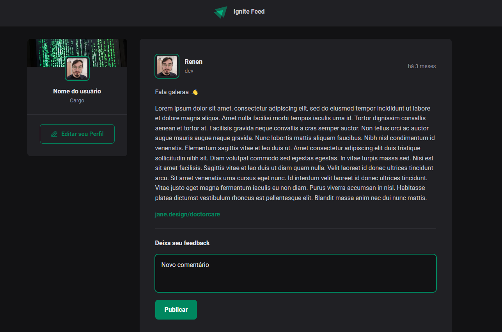

  

O Ignite-feed é um projeto desenvolvido com React e TypeScript durante o bootcamp [Ignite](https://lp.rocketseat.com.br/ignite#trilhas) da Rocketseat. 
Sua função é criar um feed de rede social que utiliza conceitos básicos do React.
- Estado
- Imutabilidade do estado
- Listas e chaves no ReactJS
- Propriedades
- Componentização

  

### Execução
1. Execute `npm i` na pasta raiz para instalar as dependências
2. Execute `npm run dev:server` para executar a fakeAPI
3. Execute `npm run dev` para executar o projeto
